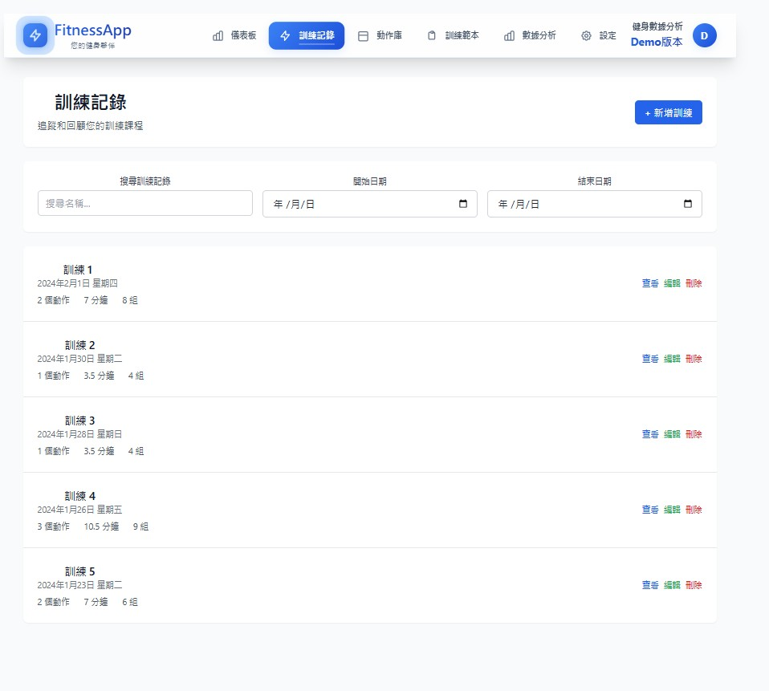

# 健身追蹤應用

專業的健身追蹤應用程式，採用現代 Web 技術架構，整合 Google Sheets 作為雲端資料儲存解決方案。

## 應用截圖

### 儀表板


### 資料分析


### 訓練記錄


### 動作庫


## 功能特色

- **智能儀表板** - 即時顯示訓練統計和進度
- **動作庫管理** - 豐富的運動動作資料庫
- **訓練記錄** - 詳細記錄每次訓練的內容
- **資料分析** - 多維度的訓練資料視覺化分析
- **課表模板** - 可重複使用的訓練模板
- **個人化設定** - 客製化的使用者體驗
- **用戶認證** - 安全的登入和資料保護
- **雲端儲存** - 使用 Google Sheets 作為免費資料庫

## 技術架構

### 前端
- **React 19** - 現代化的用戶界面框架
- **TypeScript** - 型別安全的開發體驗
- **Vite** - 快速的開發建構工具
- **TailwindCSS** - 實用優先的 CSS 框架
- **Recharts** - 數據視覺化圖表庫

### 後端
- **Node.js** - 高效能的 JavaScript 運行環境
- **Express** - 輕量級的 Web 應用框架
- **TypeScript** - 型別安全的伺服器端開發
- **JWT** - 安全的用戶認證機制
- **Google Sheets API** - 免費的雲端資料儲存

### 資料儲存
- **Google Sheets** - 作為免費的雲端資料庫
- **本地快取** - 提升應用回應速度
- **資料同步** - 自動與雲端保持同步

## 快速開始

### 環境需求
- Node.js 18+
- npm 或 yarn
- Google 帳號（用於 Sheets API）

### 安裝步驟

1. **複製專案**
```bash
git clone https://github.com/chia199712/Fitness-Web.git
cd Fitness-Web
```

2. **安裝後端依賴**
```bash
cd backend
npm install
```

3. **安裝前端依賴**
```bash
cd ../frontend
npm install
```

4. **設定環境變數**
```bash
cd ../backend
cp .env.example .env
# 編輯 .env 檔案，填入您的 Google Sheets 設定
```

5. **啟動開發伺服器**
```bash
# 啟動後端 (在 backend 目錄)
npm run dev

# 啟動前端 (在 frontend 目錄，新終端)
npm run dev
```

6. **開啟瀏覽器**
前往 `http://localhost:5173` 查看應用

## Google Sheets 設定

詳細的 Google Sheets API 設定步驟，請參考：
- [Google Sheets 設定指南](GOOGLE_SHEETS_SETUP.md)
- [本地環境設定指南](LOCAL_SETUP_GUIDE.md)

## 專案結構

```
Fitness-Web/
├── frontend/          # React 前端應用
│   ├── src/
│   │   ├── components/    # 可重用組件
│   │   ├── pages/         # 頁面組件
│   │   ├── hooks/         # 自定義 Hooks
│   │   ├── services/      # API 服務
│   │   ├── types/         # TypeScript 型別定義
│   │   └── utils/         # 工具函數
│   └── tests/         # 前端測試
├── backend/           # Node.js 後端 API
│   ├── src/
│   │   ├── controllers/   # 控制器
│   │   ├── services/      # 服務層
│   │   ├── routes/        # 路由定義
│   │   ├── middleware/    # 中間件
│   │   └── utils/         # 工具函數
│   └── tests/         # 後端測試
└── docs/              # 文檔和截圖
```

## 部署

### 生產環境部署

1. **建構前端**
```bash
cd frontend
npm run build
```

2. **建構後端**
```bash
cd ../backend
npm run build
```

3. **啟動生產伺服器**
```bash
npm start
```

詳細部署說明請參考 [部署指南](DEPLOYMENT.md)

## 開發指南

### 可用腳本

**後端**
- `npm run dev` - 開發模式啟動
- `npm run build` - 建構生產版本
- `npm start` - 啟動生產伺服器
- `npm test` - 執行測試

**前端**
- `npm run dev` - 開發模式啟動
- `npm run build` - 建構生產版本
- `npm run lint` - 程式碼檢查

### 環境變數說明

請參考 `backend/.env.example` 了解所有可用的環境變數設定。

## 技術特點

- **型別安全** - 全面使用 TypeScript 開發
- **響應式設計** - 支援各種螢幕尺寸
- **資料視覺化** - 豐富的圖表和統計功能
- **離線功能** - 支援本地快取和離線使用
- **安全認證** - JWT 令牌驗證機制
- **雲端同步** - 自動備份到 Google Sheets

完整功能的健身追蹤應用
- React + TypeScript 前端
- Node.js + Express 後端
- Google Sheets 整合
- JWT 認證系統
- 響應式設計
- 運動追蹤與模板功能# 健身應用系統更新
